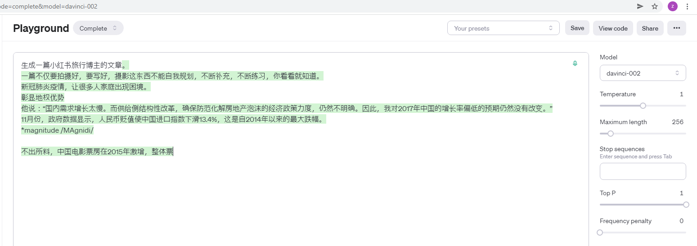
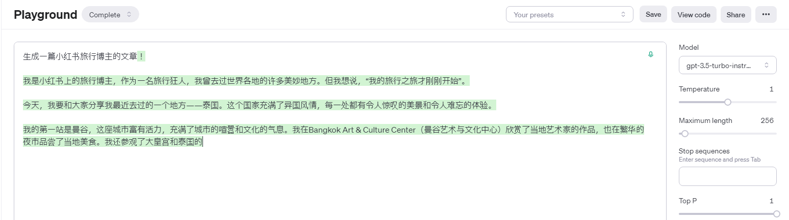
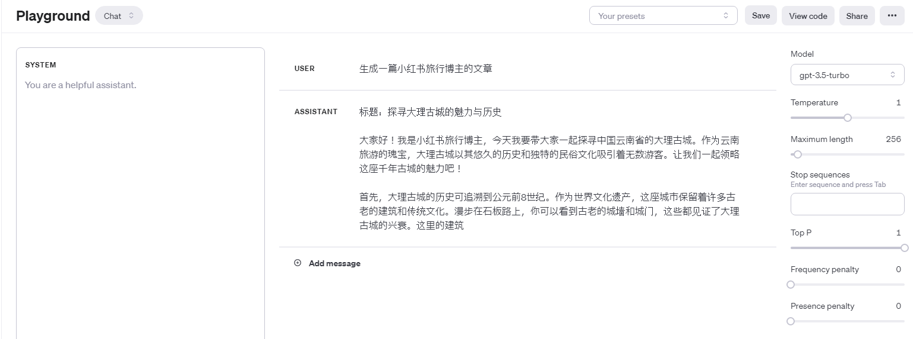

## 输入数据格式

**Prompt Completion** :`{"prompt": "<prompt text>", "completion": "<ideal generated text>"}`

仅适用于模型babbage-002 和 davinci-002微调。这两个模型是未经过指令训练的模型，意味着它们无法理解指令，只能预测下一个字。

例子：

gpt-3.5-turbo-instruct同样情形下：

gpt-3.5-turbo效果:

根据OpenAI官网公布信息:
- **gpt-3.5-turbo-1106**: 最新的 GPT-3.5 Turbo 模型具有改进的指令跟踪、JSON 模式、可重现的输出、并行函数调用等。最多返回 4,096 个输出tokens。
- **davinci-002** GPT-3 curie and davinci 基础模型的替代品.
`GPT 基础模型可以理解并生成自然语言或代码，但未接受指令训练。这些模型旨在替代原来的 GPT-3 基本模型，并使用旧版 Completions API。大多数用户应使用 GPT-3.5 或 GPT-4。`

